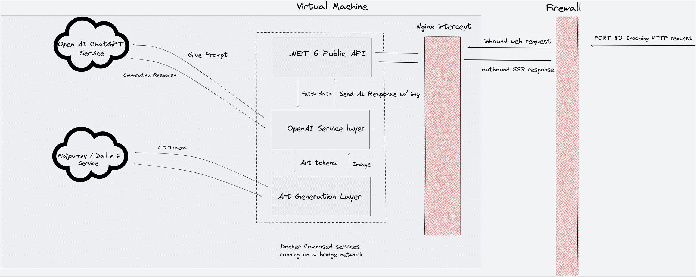

## Dungeon Master
This repo contains both the frontend and backend for the Dungeon Master program. The Application is entirely self-hosted.

- Character Sketching: Create unique and customizable characters for your Dungeons and Dragons adventures. Choose from a wide range of races, classes, and backgrounds, and visually design your character using our intuitive sketching tools.

- World Scenario Creation: Bring your D&D campaigns to life with our powerful world-building feature. Design intricate and immersive environments, including detailed maps, landmarks, and key locations. Define quests, encounters, and events to shape your players' journeys.

- Story Tracking: Keep track of your campaign's progress effortlessly. Our app automatically logs the story so far, documenting important events, character interactions, and plot developments. Never miss a crucial detail or forget a significant plot twist.

- Multi-User Collaboration: Foster collaborative storytelling with multiple players. Invite friends and fellow Dungeon Masters to join your campaign and contribute their own characters, scenarios, and narratives. Engage in real-time discussions and coordinate your adventures seamlessly.

- Interactive Responses: Generate dynamic results for all users involved. The app analyzes and interprets the actions and choices of each character, delivering immediate outcomes and consequences. Experience an ever-evolving story where your decisions truly matter.

- Random Encounter Generator: Enhance the unpredictability of your campaigns with our built-in random encounter generator. Generate exciting encounters, treasure hunts, puzzles, and more, ensuring every session is filled with surprises.

- Artwork Generation: The bot generates artowrk after each major DM prompt.

- Versatile Platform: Whether you prefer using a standalone app or utilizing popular communication platforms, such as Discord, our app seamlessly integrates with both options. Access the full functionality of Character Sketch & World Builder through the app or as a Discord bot, catering to your preferred gaming setup.

 

## High Level Architecture
 

